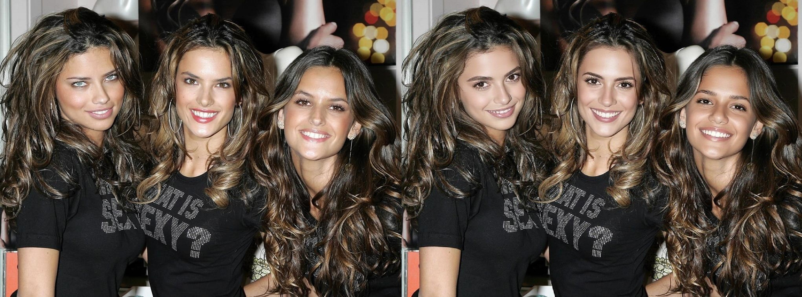
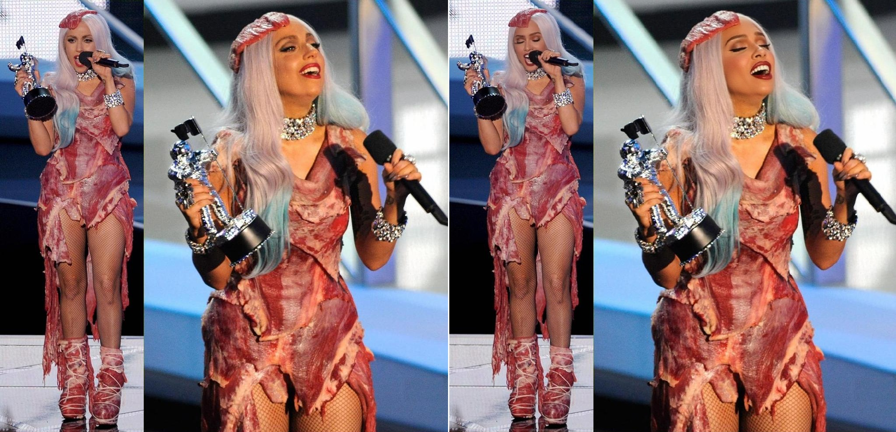
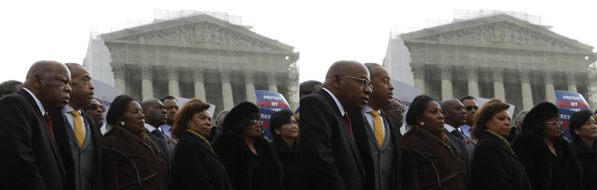

# Facial Anonymization

**A production-ready research and engineering framework for privacy-preserving image generation.**

This repository implements a facial anonymization pipeline built on ComfyUI and latent diffusion models (Z-Image-Turbo), balancing identity disruption with semantic integrity.

---

## Core Engineering Principles

- **Decoupled Architecture**: `generation.py` and `evaluation.py` are separated so each stage can be tested, profiled, and scaled independently.
- **Automated Parameter Tuning**: `main.py` uses a closed-loop generation/evaluation workflow that automatically adjusts parameters from metric feedback.
- **Modular Pipeline Design**: Shared CLI and utility logic in `shared_utils.py` keeps behavior consistent and simplifies integration into larger ML/ops workflows.

---

## Visual Examples

Below are examples of the facial anonymization process:








---

## Metrics

These metrics are not only quality indicators, they enforce a practical privacy/utility balance for responsible AI use.

- **InsightFace Distance**: Embedding-space distance between detected faces (identity removal)
- **CLIP Similarity**: Semantic similarity between original and anonymized images (semantic preservation)
- **LPIPS Distance**: Perceptual distance between original and anonymized images (perceptual quality)
- **Identity Removal vs. Semantic Preservation**: The key trade-off is maximizing InsightFace identity disruption while keeping CLIP context preservation high enough for downstream usefulness.

---

## Project Structure

```text
facial_anonymization/
├── main.py                 # Complete workflow (generation + evaluation)
├── generation.py           # Generation-only pipeline
├── evaluation.py           # Evaluation-only workflow
├── shared_utils.py         # Shared helpers and CLI definitions
├── setup.py                # Installation and configuration
├── requirements.txt        # Python dependencies
├── README.md               # This file
├── input/                  # Input images directory
├── output/                 # Generated anonymized images
├── models/                 # Pre-trained models
│   ├── text_encoders/
│   ├── unet/
│   ├── vae/
│   ├── ultralytics/
│   └── controlnet/
├── ComfyUI/                # ComfyUI framework
├── examples/               # Example outputs
└── venv/                   # Python virtual environment
```

---

## Main Scripts

| Script | Purpose |
|--------|---------|
| `setup.py` | Creates `venv`, installs dependencies, and configures ComfyUI |
| `main.py` | Complete workflow with automatic parameter tuning |
| `generation.py` | Generation-only pipeline |
| `evaluation.py` | Single image pair evaluation |
| `shared_utils.py` | Shared helpers and CLI argument definitions |

---

## Requirements

- **Python 3.10+**
- **Git**
- **NVIDIA GPU** (recommended for better performance)
- **Disk Space**: Sufficient space for models

### Optimization Note

- **VRAM Efficiency**: The pipeline relies on bf16 model weights (for example, `z_image_turbo_bf16.safetensors`) to reduce memory pressure and improve feasibility on consumer GPUs and production-like environments.

---

## Installation

### 1. Clone the Repository

```bash
git clone https://github.com/gferrerass/facial_anonymization
cd facial_anonymization
```

### 2. Run Setup

```bash
python setup.py
```

The setup script automatically:
- Creates Python virtual environment (`venv/`)
- Installs all Python dependencies
- Downloads and configures ComfyUI
- Installs required custom nodes and their dependencies

Runtime scripts will relaunch using the project's `venv` Python interpreter when needed.

### 3. Install required models

Download and place the following model files in the `models/` directory:

| Model | Path | Link |
|-------|------|------|
| Qwen Text Encoder | `models/text_encoders/qwen_3_4b.safetensors` | [Download](https://huggingface.co/Comfy-Org/z_image_turbo/blob/main/split_files/text_encoders/qwen_3_4b.safetensors) |
| Z-Image-Turbo UNet | `models/unet/z_image_turbo_bf16.safetensors` | [Download](https://huggingface.co/Comfy-Org/z_image_turbo/blob/main/split_files/diffusion_models/z_image_turbo_bf16.safetensors) |
| VAE Encoder | `models/vae/ae.safetensors` | [Download](https://huggingface.co/Comfy-Org/z_image_turbo/blob/main/split_files/vae/ae.safetensors) |
| Face Detection | `models/ultralytics/bbox/face_yolov8m.pt` | [Download](https://huggingface.co/datasets/Gourieff/ReActor/blob/main/models/detection/bbox/face_yolov8m.pt) |
| ControlNet | `models/controlnet/Z-Image-Turbo-Fun-Controlnet-Union.safetensors` | [Download](https://huggingface.co/alibaba-pai/Z-Image-Turbo-Fun-Controlnet-Union/blob/main/Z-Image-Turbo-Fun-Controlnet-Union.safetensors) |

---

## Usage

### Full Workflow (Recommended)

```bash
python main.py
```

This mode:
- Generates anonymized output
- Automatically evaluates quality metrics
- Iteratively adjusts parameters until thresholds are met (or max iterations reached)

**Examples:**

```bash
# Default settings
python main.py

# Custom input/output directories
python main.py --input input --output output

# Custom generation parameters
python main.py --strength 0.7 --denoise 0.6 --max-images 10

# Custom quality thresholds
python main.py --insightface-threshold 0.65 --clip-threshold 0.75 --lpips-threshold 0.3

# Improve performance (may reduce CLIP/LPIPS quality)
python main.py --no-controlnet
```

### Generation Only

```bash
# Default settings
python generation.py

# Custom parameters
python generation.py --input input --output output --strength 0.7 --denoise 0.6 --max-images 5

# Faster generation without ControlNet (can sacrifice CLIP/LPIPS scores)
python generation.py --no-controlnet
```

### Evaluation Only

```bash
# Evaluate a single image pair
python evaluation.py input/original.jpg output/original_anonymized_20260305_120000.png

# Skip face detection and cropping
python evaluation.py input/original.jpg output/original_anonymized_20260305_120000.png --no_crop
```

---

## CLI Parameters

### Shared by `main.py` and `generation.py`

| Parameter | Default | Description |
|-----------|---------|-------------|
| `--input` | `input` | Input directory path |
| `--output` | `output` | Output directory path |
| `--max-images` | *all* | Maximum number of images to process |
| `--strength` | `0.7` | ControlNet strength (0-1). Higher values usually enforce stronger structure preservation (stronger conservation) |
| `--denoise` | `0.6` | Sampler denoise strength (0-1). Higher values usually produce stronger anonymization |
| `--no-controlnet` | `False` | Disable ControlNet for better performance, but this can reduce CLIP and LPIPS scores |

Quick guidance:
- Increase `--denoise` for stronger anonymization.
- Increase `--strength` for stronger structure conservation when ControlNet is enabled.
- Use `--no-controlnet` to improve performance, knowing CLIP/LPIPS quality can drop.

### `main.py` Only

| Parameter | Default | Description |
|-----------|---------|-------------|
| `--insightface-threshold` | `0.65` | Target InsightFace distance |
| `--clip-threshold` | `0.75` | Target CLIP similarity |
| `--lpips-threshold` | `0.3` | Target LPIPS distance |
| `--max-iterations` | `3` | Maximum parameter tuning iterations |

### `evaluation.py` Only

| Parameter | Description |
|-----------|-------------|
| `original` | Path to the original image |
| `anonymized` | Path to the anonymized image |
| `--no_crop` | Skip face detection and cropping (use pre-cropped images) |